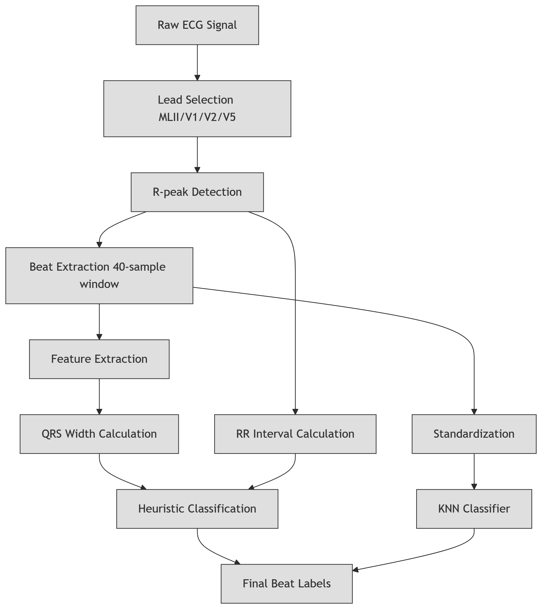
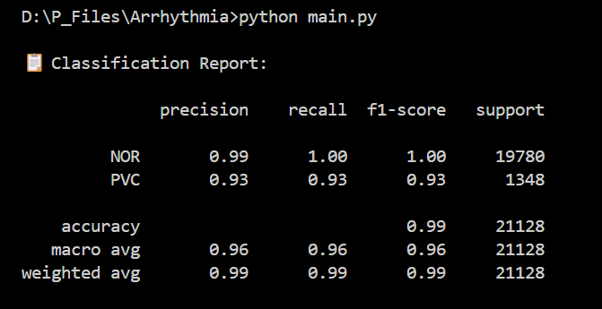
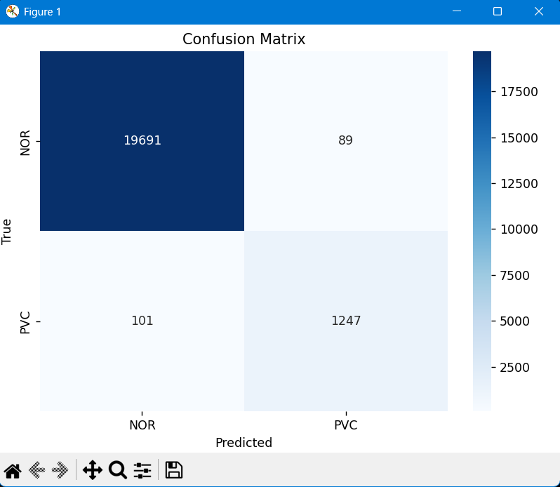

# 🫀 Arrhythmia Detection Using Explainable Machine Learning

> A signal-processing and machine learning pipeline for ECG-based arrhythmia classification using traditional interpretable models.

---

## 🧠 What is Arrhythmia?

**Arrhythmia** refers to an abnormal heart rhythm caused by irregularities in the heart's electrical impulses. These irregularities can lead to slow (bradycardia), fast (tachycardia), or erratic heartbeats, potentially causing dizziness, shortness of breath, stroke, or even sudden cardiac death.

---

## ❗ Why Detect It Early?

Timely and accurate arrhythmia detection:
- Helps prevent life-threatening cardiac events
- Reduces risk of stroke or heart failure
- Allows real-time diagnosis in clinical and wearable health applications

However, manual analysis of ECG signals is time-consuming and error-prone. That’s where machine learning steps in.

---

## ⚙️ How This Project Works

This repository implements a hybrid **ECG beat segmentation and machine learning classification pipeline** to detect arrhythmia types using a dataset of ECG signals (e.g. MIT-BIH). It uses **interpretable models** like K-Nearest Neighbors for explainability and low complexity.

---

## 🧪 Model Architecture

The pipeline follows a structured flow starting from raw ECG signal to final arrhythmia classification. It includes preprocessing, heuristic labeling, beat segmentation, and machine learning.

<p align="center">
  
</p>


## 🛠 Features

- 🔍 **R-Peak Detection**: Uses `scipy.signal.find_peaks` to detect QRS complexes based on inter-peak distance (approx. 0.6s).
- 📐 **Beat Segmentation**: Extracts 40-sample windows centered around each R-peak.
- 🧠 **Heuristic Beat Labeling**:
  - QRS width estimation via derivative thresholding
  - RR interval calculation
  - Labeled as one of: `NOR`, `PVC`, `APC`, `LBB`, or `RBB`
- 🗃️ **Beat Dataset Generation**: Saves a `labels.csv` mapping filenames to their majority beat class.
- 📊 **Feature Scaling**: StandardScaler normalizes beat data before training.
- 🤖 **Classification Model**: K-Nearest Neighbors (KNN) classifier trained on ECG beats.
- 📈 **Evaluation**:
  - Classification report (precision, recall, F1-score)
  - Confusion matrix heatmap using `seaborn`

---

## 🧪 Example Results

Once the model is trained, you’ll see outputs like the classification report and a confusion matrix.

| Metric         | Value     |
|----------------|-----------|
| Accuracy       | 96%     |
| F1-score       | 0.99      |
| Confusion Matrix | ✅ Visualized using `seaborn` |

<p align="center">
  
</p>

The classification report shows precision, recall, and F1-scores for each class (e.g., NOR, PVC, APC, etc.), and the confusion matrix provides a visual breakdown of true vs predicted labels.

---
➡️ **Confusion Matrix**  
A heatmap showing true vs predicted classes using `seaborn`.

<p align="center">
  
</p>

---

## 🧑‍💻 How to Use This Repository

### 1. 📁 Prepare Your Dataset

Place your ECG `.csv` signal files in a folder named `dataset/`.  
Each file should contain at least one of these columns:
MLII, V1, V2, V5

---

### 2. 📦 Install Dependencies

First, clone the repo and install required Python packages.

```bash
git clone https://github.com/your-username/arrhythmia-detector.git
cd arrhythmia-detector
pip install -r requirements.txt

numpy
scipy
scikit-learn
pandas
matplotlib
seaborn
```
3. 🏷️ Run Label Generator
This script processes all .csv files in dataset/ and generates labels.csv based on heuristic rules.
```bash
python labels.py
```

4. 🤖 Train and Evaluate Classifier
This runs the full ML pipeline:

Loads ECG beats and labels

Scales features

Splits train/test data

Trains KNN model

Prints classification report

Plots confusion matrix

```bash
python main.py
```
📁 File Structure
```bash
arrhythmia-detector/
├── dataset/             # ECG CSV files
├── labels.py            # Heuristic labeling script
├── main.py              # ML pipeline
├── labels.csv           # Output labels
├── result.png           # Classification result screenshot
├── matrix.png           # Confusion matrix image
├── model.png            # Model architecture diagram
├── requirements.txt     # Required libraries
└── README.md            # This file
```
📌 Notes
Input files must be .csv ECG signals containing one valid lead column.

You can replace KNN with other models (SVM, RF) by editing main.py.

PCA is not included by default, but can be easily added for dimensionality reduction.

🚀 Future Improvements
Add PCA for better feature reduction

Integrate Pan-Tompkins algorithm for R-peak detection

Extend support for 12-lead ECGs

Test ensemble models or deep learning classifiers

Build real-time streaming interface for wearable health monitors

📄 License
This project is licensed under the MIT License.

🤝 Acknowledgements
This project was developed as part of a Bachelor’s thesis submitted to:

Maulana Abul Kalam Azad University of Technology, West Bengal
Under the guidance of Dr. Sriparna Saha

🔗 For questions, improvements, or collaborations, feel free to open an issue or submit a pull request.

---

Let me know if you'd like help:
- Designing `model.png`, `result.png`, or `matrix.png`
- Adding GitHub badges (stars, forks, license)
- Publishing this as a template repo or educational tool
- And if you love this , don't forget to make a star to this repo
  
I'm happy to help finalize your release!


